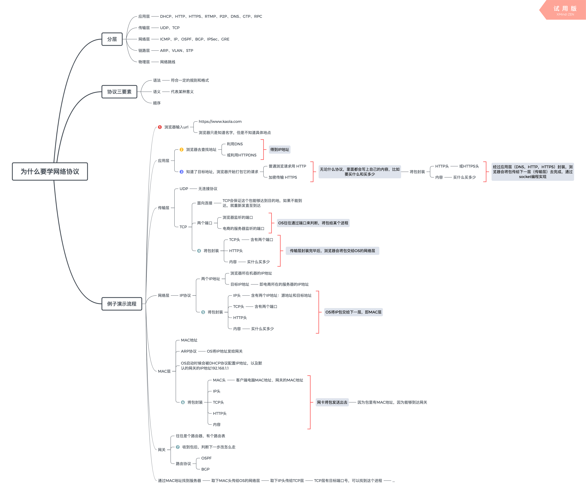

# 网络协议

## 一. [趣谈网络协议](https://time.geekbang.org/column/intro/85)

### 1. 通信协议综述

#### 1.1 为什么要学习网络协议：从输入 URL 到下单成功的简单流程分析

- ##### 网络协议分析：电商购物

- ##### [当网络包到达一个城关的时候，可以通过路由表得到下一个城关的 IP 地址，直接通过 IP 地址找就可以了，为什么还要通过本地的 MAC 地址呢？](/Notes/Network/MAC地址.md)

#### 1.2 网络分层的真实含义：解密层与层之间的关系

- ##### 程序是如何工作的

  

### 2. 从第二层到第三层

##### 1.1 网关 Gateway

##### 1.2 路由协议

### 3. 最重要的传输层

##### 1.1 UDP 协议

##### 1.2 TCP 协议:三次握手、四次挥手、状态机

.png>)

- TCP 三次握手状态时序图

- TCP 四次挥手状态时序图

- TCP 状态机

##### 1.3 TCP 协议:实现靠谱的协议、顺序问题、丢包问题、流量控制、拥塞控制

.png>)

- TCP BBR 拥塞算法

##### 1.5 套接字 Socket: 基于 TCP/UDP 协议的 Socket、服务器如何连更多项目

- 基于 TCP 协议的 Socket 程序函数调用过程

- 基于 UDP 协议的 Socket 程序函数调用过程

- Linux 进程复制过程

- Linux 下创建线程

## 二. 参考文章

1.  [跟着动画来学习 TCP 三次握手和四次挥手](https://juejin.im/post/5b29d2c4e51d4558b80b1d8c)
